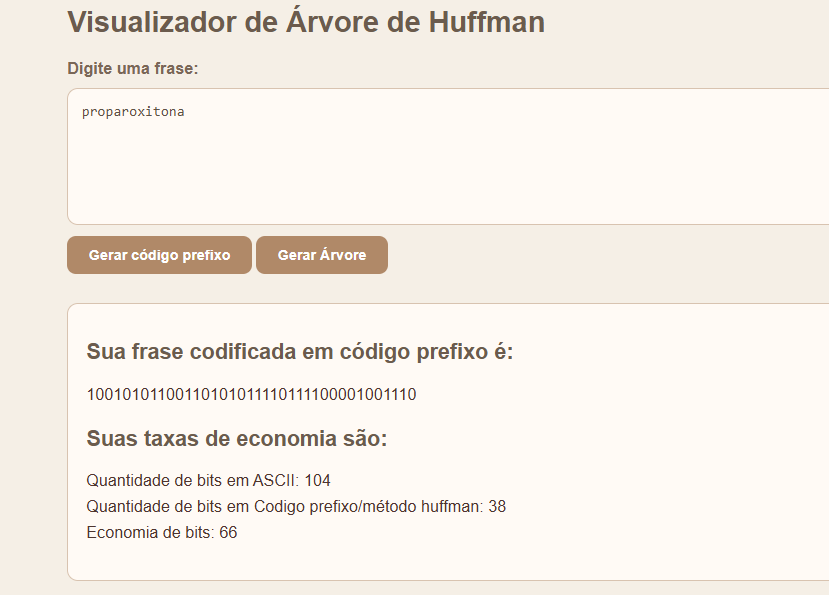
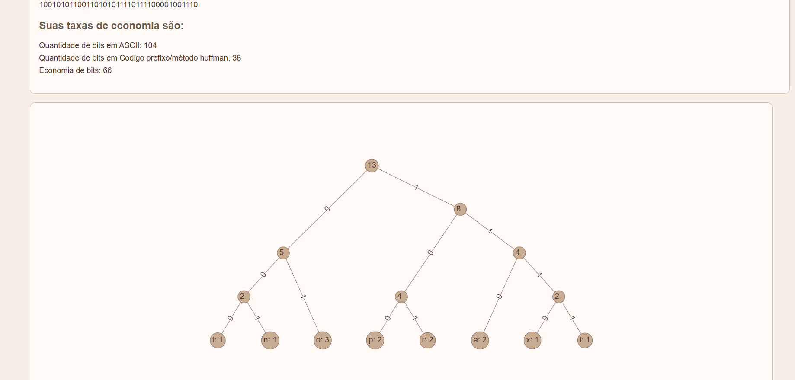
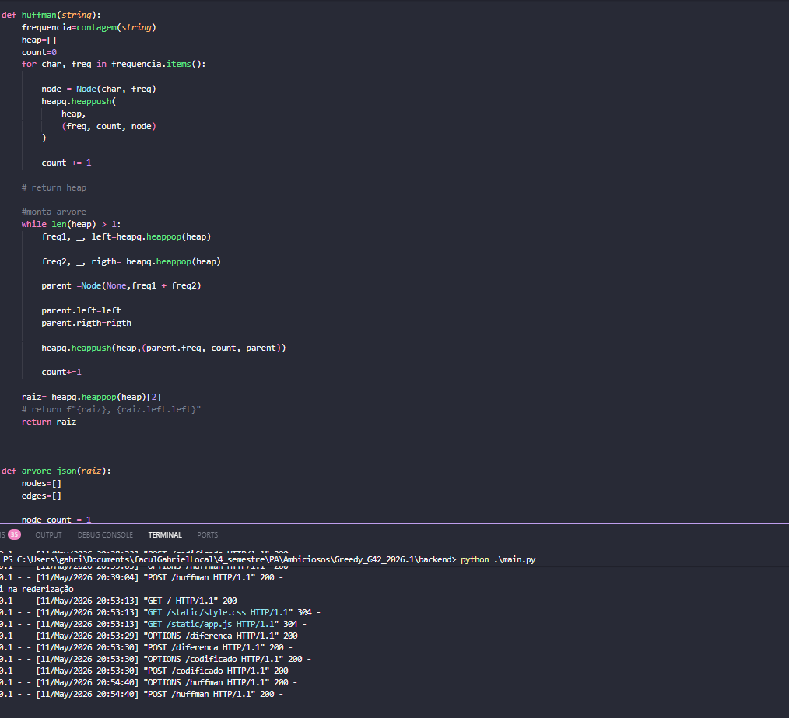

# G42_Greed_PA-26.1

Número da Lista: 42 
Conteúdo da Disciplina: Algoritmos Ambiciosos 

## Alunos
|Matrícula | Aluno |
| -- | -- |
| 242004706  |  Gabriel Vieira Octacilio Pinheiro |
| 242015989  |  Zayra Batista Moraes |

## Sobre 
Projeto G42: Aplicação de visualização de metodo hufmam, evidência a tx de economia de bits entre tabela ascII e codigo prefixo

**Funcionalidades:**
- Algoritmo ambicioso - hufman -  (`algoritmo.py`): Responsável por montar as árvores  e codificar a string 
- `app.js` responsavel por funcionalidades de interface com o usuario 

## Screenshots

Tela principal mostrando taxa de economia de bits 

Resultado da arvore com peso e valor nas arestas

algoritmo hufman com log de endpoints

## Instalação 
**Linguagem:** Python 3.10+  
**Framework:** `flask` `flask-cors` 

1. Clone o repositório.
2. Instale dependências:  

   ``pip install -r requirements.txt``

## Uso 

entre na pasta`/Greedy_G42_2026.1/backend`
rode `pip install -r requirements.txt`
rode `python main.py`
Abra http://localhost:5000.

## Vídeo apresentação

O vídeo de apresentação pode ser acessado clicando no link abaixo.

[Apresentação]()